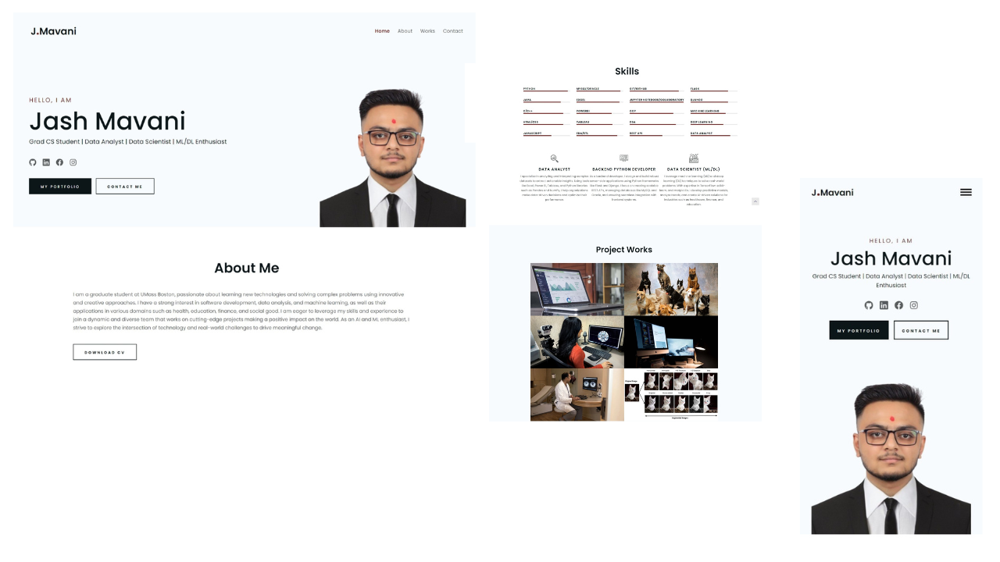

# Portfolio Website



## Overview

This repository contains a professionally designed, fully responsive portfolio website template built with core web technologies: **HTML**, **CSS**, and **JavaScript**. The template is crafted to emphasize simplicity and elegance while maintaining adaptability for various professional use cases, including academic profiles, research portfolios, and project showcases.

---

## Table of Contents

1. [Features](#features)  
2. [Live Preview](#live-preview)  
3. [Getting Started](#getting-started)  
4. [Customization](#customization)  
5. [Deployment](#deployment)  
6. [License](#license)  

---

## Features

### Core Attributes

- **Responsive Design**: Ensures seamless performance across devices of varying screen sizes.
- **Single-Page Layout**: Optimized for accessibility and streamlined navigation.
- **Customizability**: Facilitates rapid adaptation to reflect personal branding and professional accomplishments.
- **Minimalist Aesthetic**: A clean, distraction-free design tailored to highlight essential content.

---

## Live Preview

Explore the live version of this portfolio website [here](https://jash.github.io/).

---

## Getting Started

### Prerequisites

To get started, ensure you have the following tools installed:
- [Git](https://git-scm.com/)
- A text editor or IDE (e.g., [VS Code](https://code.visualstudio.com/))
- A web browser for testing

### Installation Steps

1. **Clone the Repository**:
    ```bash
    git clone https://github.com/Jashmavani9002/jash.github.io.git
    ```

2. **Open in Your IDE**: 
    Navigate to the project folder and open it in your preferred IDE or text editor.

3. **Launch the Project**: 
    Open the `index.html` file in a web browser to view the portfolio locally.

---

## Customization

### Personalize Content

Replace the default placeholder content with your details:
- **About Section**: Update with your professional summary, qualifications, and interests.
- **Project Showcase**: Add links, descriptions, and visual previews of your key works.
- **Contact Information**: Provide your preferred communication channels (email, LinkedIn, etc.).

### Modify Styling

Edit the CSS file (`styles.css`) to match your preferred color scheme and typography.

---

## Deployment

### GitHub Pages

1. **Push Changes to GitHub**: Commit and push your changes to the repository.
2. **Enable GitHub Pages**:
    - Go to your repository settings on GitHub.
    - Navigate to the "Pages" section and configure the source branch (usually `main`).
3. **Access the Live Site**: Your portfolio will be available at `https://<username>.github.io/`.

### Alternative Hosting

You can also host the portfolio on other platforms like [Netlify](https://www.netlify.com/) or [Vercel](https://vercel.com/).

---

## License

This project is distributed under the **MIT License**. You are free to use, modify, and distribute this code, provided attribution is given to the original creator.

---

## Acknowledgments

Special thanks to open-source contributors and the web development community for providing inspiration and tools to create this portfolio template.
